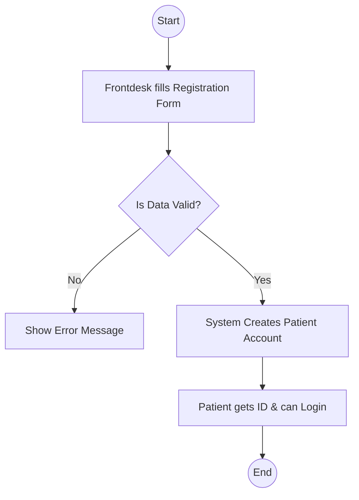
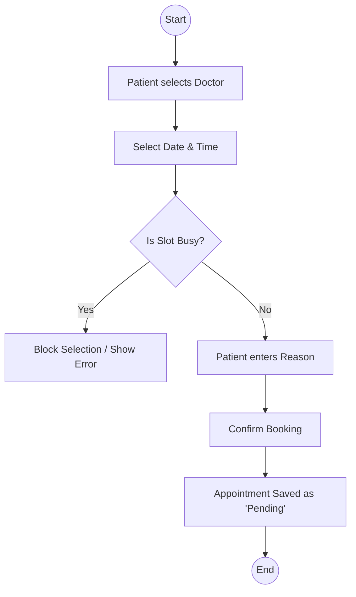
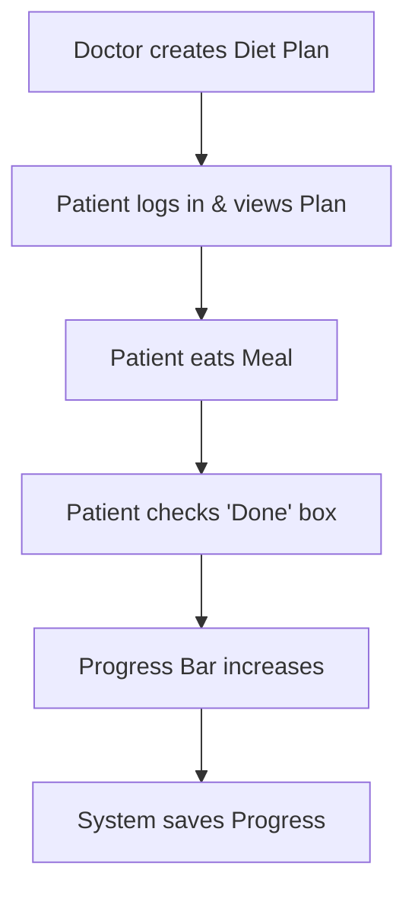
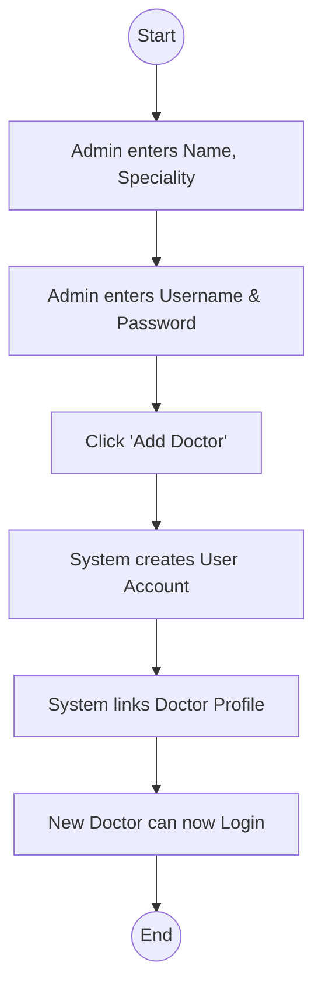

# DMS Project Documentation & Workflows

This document outlines the key workflows of the Dietitian Management System (DMS) in a simple, easy-to-understand format.

## 1. User Roles

*   **Admin**: Enters Docresolvedtors into the system.
*   **Dietitian**: Manages Patients and creates Diet Plans.
*   **Patient**: Books appointments and tracks Diet progress.
*   **Frontdesk**: Registers new Patients.

## 2. Workflows

### A. Patient Registration & Login

### B. Appointment Booking

### C. Diet Plan & Tracking

### D. Adding a New Doctor (Admin)

## 3. Data Storage (Technical Note)
*   **Local Storage**: All Diet Plans and Progress are saved in your browser, so they don't disappear when you refresh the page.
*   **Mock Data**: Default users and appointments are reset if you reload, but your new additions (like Diet Plans) stick around.
